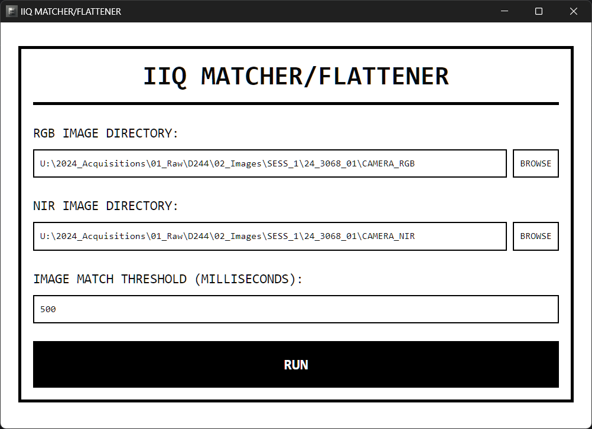

# IIQ MATCHER/FLATTENER

## Overview

IIQ MATCHER/FLATTENER is a utility for preprocessing raw image directories from the ACO plane before using IX Capture to generate 4-band CIR imagery. It addresses issues with image matching due to camera triggering delays and ensures compatibility with IX Capture's "By File" import method.

Key functions:
- Equalizes the number of RGB and NIR images
- Flattens the directory structure for batch processing
- Moves unmatched images to an "unmatched" subdirectory

## Screenshot

## Installation

Download the installer from the [releases page](https://github.com/HakaiInstitute/iiq-matcher-flattener/releases). The installer will set up the application and create a desktop shortcut.

## Usage

1. Select the RGB and NIR directories (typically "CAMERA_RGB" and "CAMERA_NIR").
2. Set the maximum acceptable shutter delay for image matching (default: 500ms).
3. Click "RUN" to process the images.

## Technical Details

- Built with [Tauri](https://tauri.app/), combining Rust backend with React frontend
- Uses the [`ix-match`](https://github.com/HakaiInstitute/ix-match) library for image matching
- Configured with auto-update functionality

## Development

To set up the development environment:
1. Install Tauri
2. Run `npm run tauri dev` for the development server
3. Use `npm run tauri build` to build the application

## Releasing Updates

1. Update the version in `src-tauri/tauri.conf.json` and `src-tauri/Cargo.toml`
2. Push a matching `v*.*.*` tag to GitHub
3. GitHub Actions will automatically build and draft a new release

For any questions or issues, please contact [Taylor Denouden](mailto:taylor.denouden@hakai.org) or the Hakai tech team.